# Retail Store Microservices Production Deployment

Production-grade cloud-native retail platform deployed on AWS using Terraform-based Infrastructure as Code (IaC) with remote state management in Amazon S3. The platform is designed for high availability, scalability, security, and fully automated continuous delivery.

<table>
  <tr>
    <td>
      <b>Core Infrastructure</b>
      <ul>
        <li>Amazon VPC across 3 Availability Zones</li>
        <li>Public and Private subnet segmentation</li>
        <li>Internet Gateway + Multi-AZ NAT Gateways</li>
        <li>Amazon EKS cluster with multi-AZ worker nodes</li>
        <li>AWS IAM Roles and Policies</li>
        <li>AWS Secrets Manager</li>
      </ul>
    </td>
    <td>
      <b>Kubernetes Platform Components</b>
      <ul>
        <li>AWS Load Balancer Controller</li>
        <li>Karpenter dynamic node provisioning</li>
        <li>Horizontal Pod Autoscaler (HPA)</li>
        <li>ExternalDNS with Amazon Route 53</li>
        <li>Helm-based application deployments</li>
      </ul>
    </td>
    <td>
      <b>Dataplane Services</b>
      <ul>
        <li>Amazon RDS MySQL</li>
        <li>Amazon RDS PostgreSQL</li>
        <li>Amazon DynamoDB</li>
        <li>Amazon ElastiCache Redis</li>
        <li>Amazon SQS</li>
      </ul>
    </td>
  </tr>
  <tr>
    <td>
      <b>DevOps & GitOps</b>
      <ul>
        <li>Terraform infrastructure provisioning</li>
        <li>GitHub Actions CI/CD pipelines</li>
        <li>ArgoCD GitOps deployments</li>
        <li>Argo Rollouts for progressive delivery</li>
        <li>Amazon ECR container registry</li>
      </ul>
    </td>
    <td>
      <b>Observability Stack</b>
      <ul>
        <li>AWS Distro for OpenTelemetry</li>
        <li>Amazon CloudWatch</li>
        <li>Amazon Managed Prometheus</li>
        <li>Amazon Managed Grafana</li>
      </ul>
    </td>
    <td>
    </td>
  </tr>
</table>


## Implementation
### Pre-requisites
#### Install and configure the admin environment
 - AWS Credentials using Console - IAM
   - Create a machine User if not exists
   - Generate Access Key, selecting CLI option
   - Save Access Key ID and Secret Access Key
 - Terraform CLI
 - AWS CLI
 - VS Code and Terraform Extension

### Terraform Remote State File
The Terraform State files of all project is managed remotely in an S3 Bucket provisioned using the ***01_remote_backend_s3bucket*** terraform code.
Execute the terraform init, validate, plan, and apply -auto-approve. Wait for the Output, and copy the bucket ID just provisioned. This ID will be used throughout the Terraform project components.

```bach
apple@apples-MacBook-Pro 01_remote_backend_s3bucket % terraform output                                                 
tfstate_bucket_arn = "arn:aws:s3:::tfstate-dev-eu-central-1-a65beq"
tfstate_bucket_id = "tfstate-dev-eu-central-1-a65beq"
```

### VPC
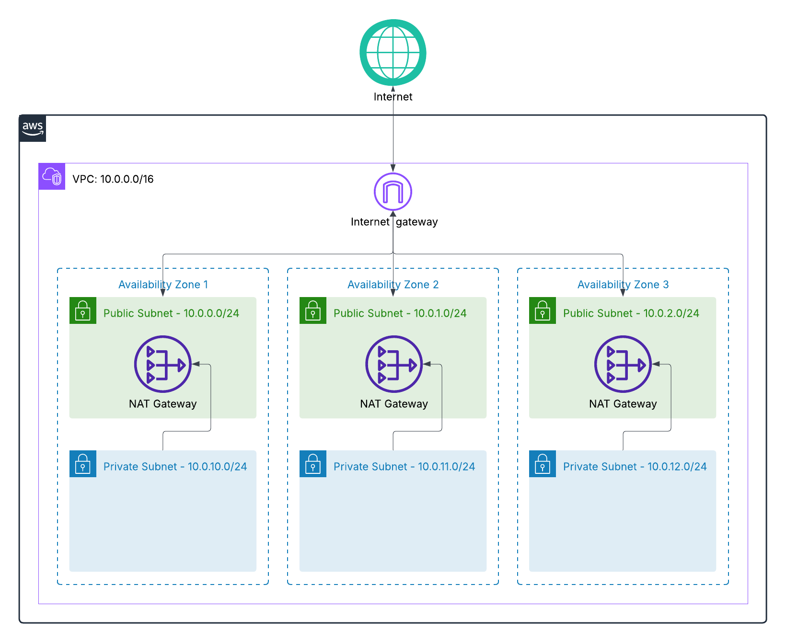

The platform network layer is built within a dedicated AWS VPC using the CIDR block 10.0.0.0/16. The VPC is distributed across three Availability Zones to ensure high availability, fault tolerance, and resilient service communication.
The following resources are created by the terraform project:
 - 1 VPC
 - 1 Internet Gateway
 - 3 Public Subnets distributed across
 - 3 Private Subnets distributed across
 - 3 Elastic IP for Nat Gateways
 - 3 NAT Gateway
 - Dedicated public and private route tables and it's association to respective Subnets

The VPC Public and Private subnets calculation:
```bash
apple@apples-MacBook-Pro aws-eks-microservices-deployment % terraform console
> cidrsubnet("10.0.0.0/16", 8, 0)
"10.0.0.0/24"
> cidrsubnet("10.0.0.0/16", 8, 1)
"10.0.1.0/24"
> cidrsubnet("10.0.0.0/16", 8, 2)
"10.0.2.0/24"
> cidrsubnet("10.0.0.0/16", 8, 0+10)
"10.0.10.0/24"
> cidrsubnet("10.0.0.0/16", 8, 1+10)
"10.0.11.0/24"
> cidrsubnet("10.0.0.0/16", 8, 2+10)
"10.0.12.0/24"
```

The terraform project source code that defines VPC have the following structure:
| File | Description |
|------|-------------|
| `c1_versions.tf` | Defines Terraform CLI/provider version constraints and configures the remote S3 backend for centralized state management, encryption, and state locking. Initializes the AWS provider configuration for infrastructure provisioning |
| `c2_variables.tf` | Declares root module input variables including AWS region, VPC CIDR range, subnet sizing, environment naming, and global tagging strategy. Centralizes reusable deployment parameters |
| `c3-vpc.tf` | Instantiates the reusable VPC module and injects environment-specific variables into the module abstraction layer |
| `c4-outputs.tf` | Exports critical networking resources including VPC ID and subnet IDs for downstream infrastructure dependencies such as EKS, Load Balancers, and database services |
| `modules/` | Implements a modular Terraform architecture to encapsulate reusable infrastructure components, improve code maintainability, simplify environment replication, and enforce separation of concerns. |
| `modules/vpc/datasources-and-locals.tf` | Retrieves dynamic AWS Availability Zone metadata and computes deterministic subnet CIDR allocations using Terraform local values and cidrsubnet() functions. |
| `modules/vpc/main.tf` | Implements the complete VPC network stack including VPC, subnets, Internet Gateway, NAT Gateways, route tables, and subnet associations across multiple Availability Zones. |
| `modules/vpc/outputs.tf` | Exports internal VPC module resources to the root module, enabling cross-module resource referencing and dependency injection for higher-level infrastructure components. |
| `modules/vpc/variables.tf` | Defines module-scoped input variables to parameterize VPC deployment behavior, enabling reusable and environment-agnostic infrastructure provisioning. |
| `terraform.tfvars` | Provides environment-specific runtime values for Terraform variables including AWS region, CIDR ranges, subnet sizing, environment naming, and tagging metadata. |

##### VPC Terraform code execution output
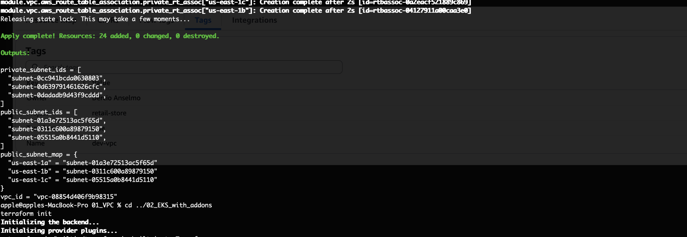

##### VPC Console Resource map
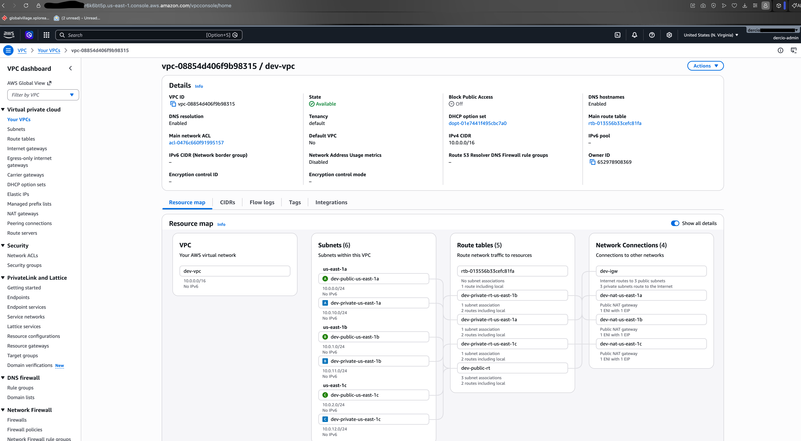

##### VPC Console tags
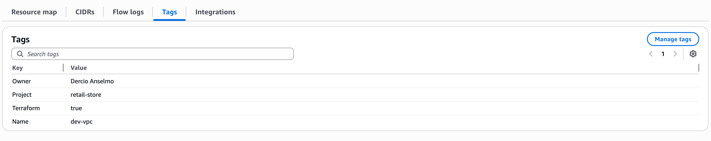

---

### EKS Cluster
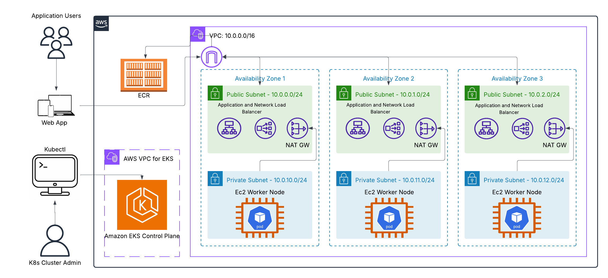

The environment consists of an AWS-managed Kubernetes control plane distributed across multiple Availability Zones, initially backed by three EC2 On-Demand worker nodes.
#### The Terraform Output, as well the the resource viewed in the console
EKS Cluster Terraform Apply Output
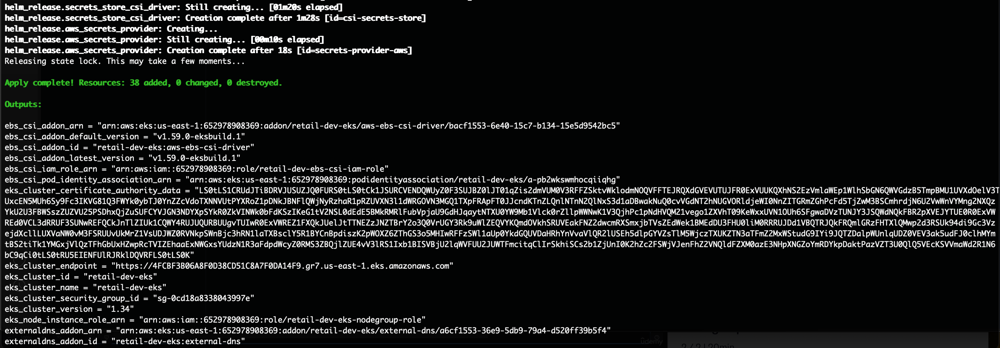
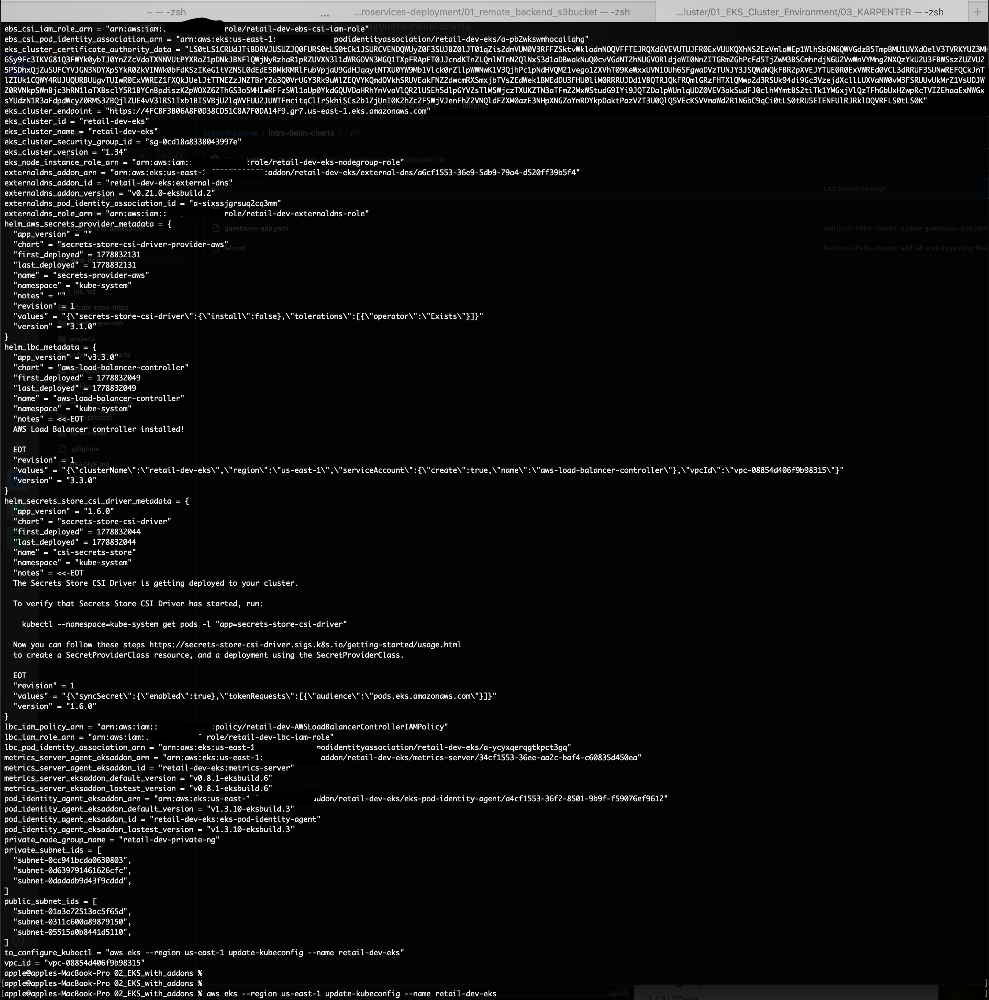

EKS Cluster Karpenter Terraform Apply Output
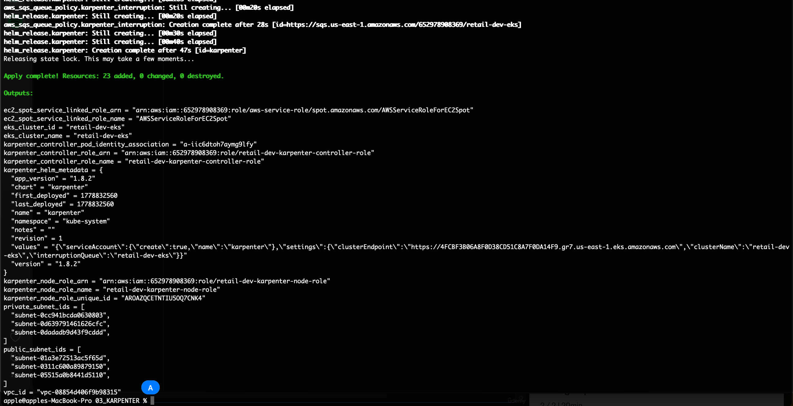

EKS Cluster OpenTelemetry Terraform Apply Output
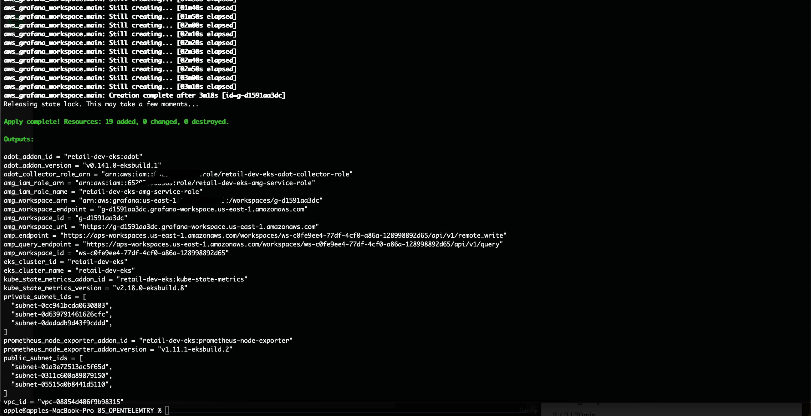

EKS Cluster Overview
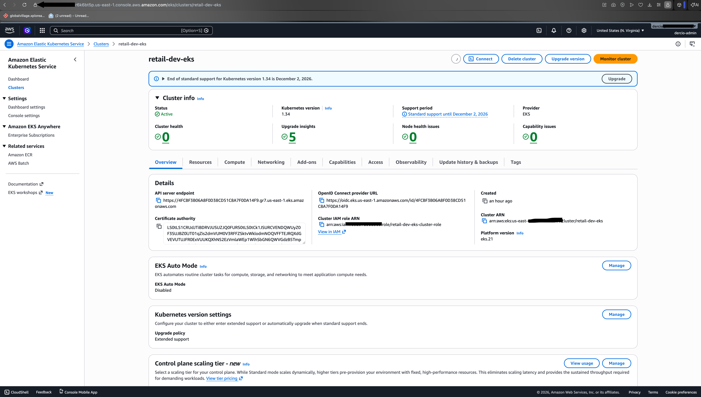

EKS Cluster - Overview


EKS Cluster - NodeGroup
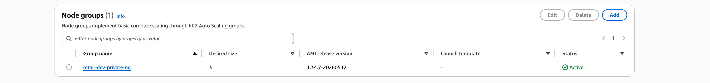

EKS Cluster - Networking
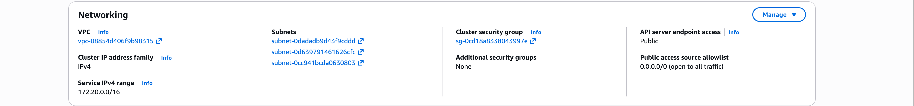

EKS Cluster - AddOns
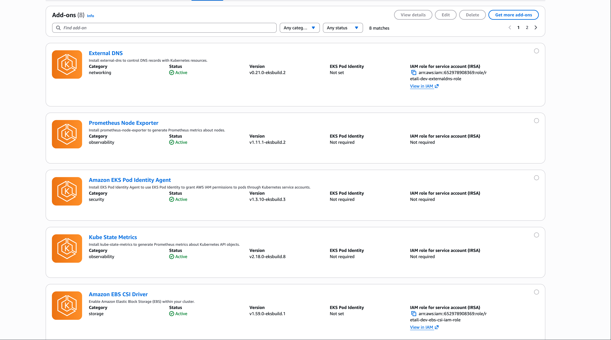


EKS Cluster - Access
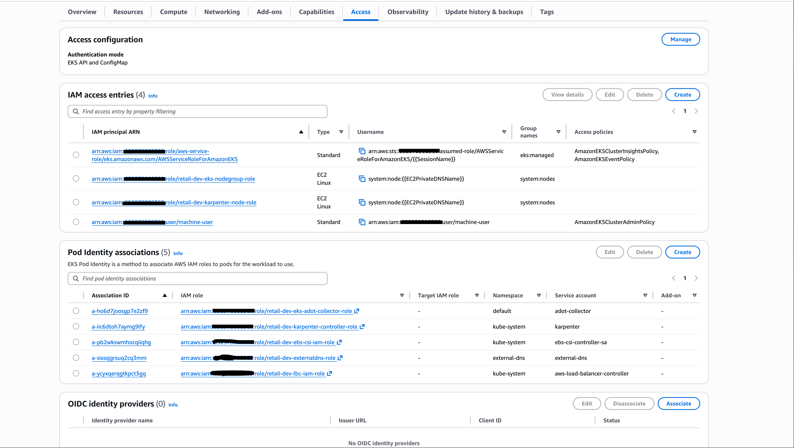

EKS Cluster - NodeGroup details
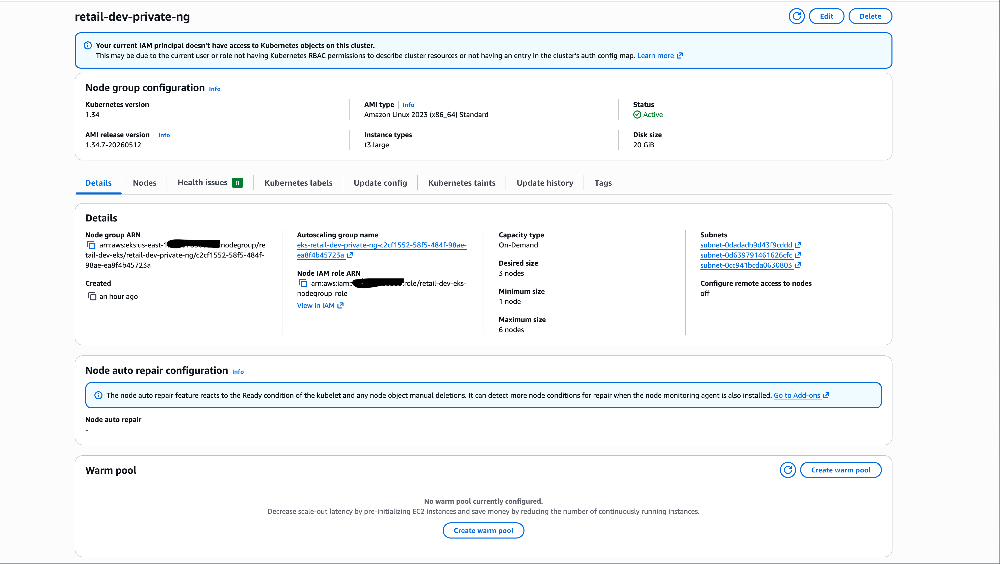

EKS Cluster - EC2 Nodes
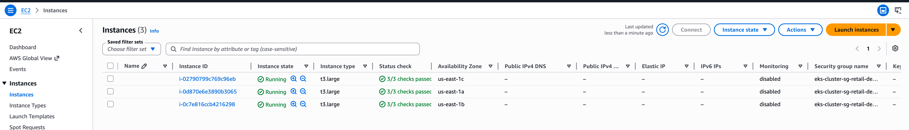

EKS Cluster - IAM Roles
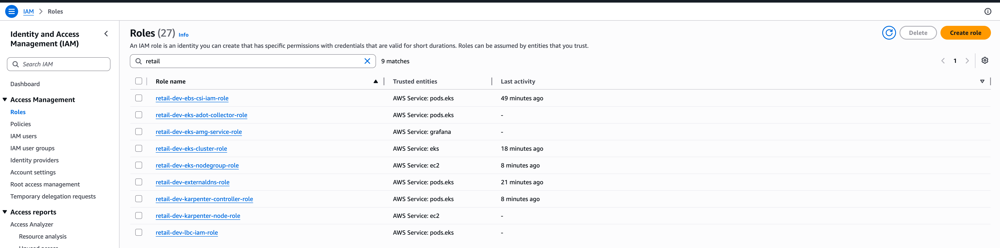

EKS Cluster - IAM Policies
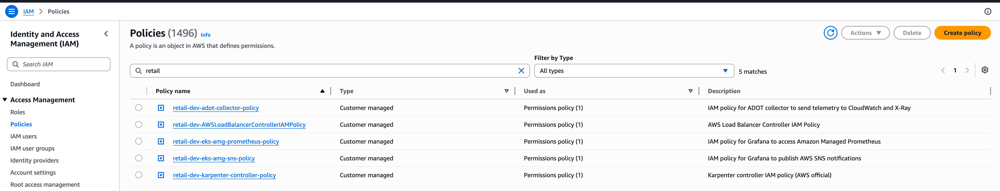

---

#### The provisioning Terraform project source code files:
##### Core EKS Cluster + AddOns
| File | Description |
|------|-------------|
| `c1_versions.tf` | Pins Terraform CLI and provider versions (AWS, Kubernetes, Helm, HTTP) to ensure deterministic IaC execution across environments. Configures remote state backend in Amazon S3 with encryption and state locking to guarantee consistent multi-user Terraform state management. |
| `c2_variables.tf` | Defines all input parameters for the EKS platform including AWS regions, environment metadata, cluster configuration, endpoint exposure settings, node group sizing, and tagging strategy. Acts as the global configuration interface for the entire EKS infrastructure layer. |
| `c3_remote-state.tf` | Consumes VPC state from a remote S3 backend using Terraform remote state data source, enabling cross-stack infrastructure integration. Exposes VPC ID and subnet topology to EKS for cluster networking and node placement. |
| `c4_datasources_and_locals.tf` | Computes deterministic naming conventions using Terraform locals to standardize resource identity across the platform. Builds structured naming hierarchy combining business division, environment, and cluster identifiers for consistent tagging and resource naming. |
| `c5_eks_tags.tf` |  Are the glue that connects AWS networking to the Kubernetes services. Applies required AWS EKS subnet tagging model for Kubernetes load balancer integration and node provisioning. Marks subnets as owned to enable worker node and Karpenter provisioning, while configuring ELB and internal ELB routing for service exposure across public and private subnets. |
| `c6_eks_cluster_iamrole.tf` | Creates the IAM role assumed by the Amazon EKS control plane through an STS trust policy with eks.amazonaws.com. Attaches AmazonEKSClusterPolicy for cluster management operations and AmazonEKSVPCResourceController for ENI and advanced VPC networking management required by production EKS workloads. |
| `c7_eks_cluster.tf` | Provisions the Amazon EKS control plane with private subnet integration, configurable public/private API endpoint access, Kubernetes service CIDR allocation, and control plane logging enabled for API, audit, authentication, scheduler, and controller visibility. Configures hybrid authentication using both aws-auth ConfigMap and EKS Access Entries API while automatically granting cluster-admin |
| `c8_eks_nodegroup_iamrole.tf` | Creates the IAM role assumed by EC2 worker nodes in the EKS managed node group. Attaches AmazonEKSWorkerNodePolicy for Kubernetes node operations, AmazonEKS_CNI_Policy for ENI/network management through the VPC CNI plugin, and AmazonEC2ContainerRegistryReadOnly for pulling container images from Amazon ECR. |
| `c9_eks_nodegroup_private.tf` | Provisions an Amazon EKS managed node group across private subnets using Amazon Linux 2023 EC2 worker nodes. Configures Kubernetes node autoscaling, rolling update behavior, node labels, On-Demand/Spot capacity selection, and EKS-integrated IAM permissions for cluster operations, VPC CNI networking, and Amazon ECR image pulls. |
| `c10_eks_outputs.tf` | Exports critical Amazon EKS infrastructure metadata including cluster endpoint, cluster ID, Kubernetes version, certificate authority data, node group name, IAM role ARN, and cluster security group ID. Provides integration outputs required for kubectl access configuration, downstream infrastructure dependencies, automation workflows, and Kubernetes platform operations. |
| `c11-podidentityagent-eksaddon.tf` | Deploys the Amazon EKS Pod Identity Agent managed add-on using the latest version compatible with the cluster Kubernetes version. Enables secure IAM role association directly to Kubernetes pods without relying on node-level IAM permissions, supporting fine-grained workload identity and least-privilege access control. |
| `c12-helm-and-kubernetes-providers.tf` | Configures Terraform Helm and Kubernetes providers using dynamic authentication against the Amazon EKS API server. Enables Terraform to provision Kubernetes-native resources, Helm charts, namespaces, controllers, add-ons, and platform services directly inside the EKS cluster. |
| `c13-podidentity-assumerole.tf` | Defines the IAM trust policy used by Amazon EKS Pod Identity, allowing Kubernetes pods authenticated through pods.eks.amazonaws.com to assume AWS IAM roles via STS. Enables secure pod-level IAM access without exposing permissions through EC2 worker node instance roles. |
| `c14-01-lbc-iam-policy-datasources.tf` | Defines the IAM trust policy used by Amazon EKS Pod Identity, allowing Kubernetes pods authenticated through pods.eks.amazonaws.com to assume AWS IAM roles via STS. Enables secure pod-level IAM access without exposing permissions through EC2 worker node instance roles. |
| `c14-02-lbc-iam-policy-and-role.tf` | Creates the IAM policy for the AWS Load Balancer Controller using the upstream JSON policy document and provisions a dedicated IAM role with a pod identity trust relationship. Attaches the controller policy to the role, enabling Kubernetes-managed provisioning of ALB/NLB resources through AWS APIs via least-privilege IAM access. |
| `c14-03-lbc-eks-pod-identity-association.tf` | Configures an EKS Pod Identity Association linking the aws-load-balancer-controller Kubernetes service account in the kube-system namespace to a dedicated IAM role. Enables the AWS Load Balancer Controller to securely assume IAM permissions at pod level for provisioning and managing ALB/NLB resources without using node IAM credentials. |
| `c14-04-lbc-helm-install.tf` | Deploys the AWS Load Balancer Controller into the EKS cluster using the Helm provider, bound to the kube-system namespace with explicit dependency on IAM role, node group, and pod identity association. Configures cluster name, VPC ID, and region to enable Kubernetes Ingress resources to dynamically provision and manage AWS ALB/NLB load balancers via the AWS API. |
| `c15-01-ebscsi-iam-policy-and-role.tf` | Creates an IAM role for the Amazon EBS CSI Driver using a Kubernetes pod identity trust policy. Attaches the AWS managed AmazonEBSCSIDriverPolicy to enable dynamic provisioning, attachment, and lifecycle management of EBS volumes for Kubernetes PersistentVolumes in EKS. |
| `c15-02-ebscsi-eks-pod-identity-association.tf` | Maps the Amazon EBS CSI driver Kubernetes service account to an IAM role using EKS Pod Identity, enabling secure pod-level access to AWS EBS APIs for volume provisioning without node-based credentials. |
| `c15-03-ebscsi-eksaddon.tf` | Deploys the Amazon EBS CSI Driver as an EKS managed add-on with version discovery based on cluster Kubernetes version, enabling dynamic persistent volume provisioning via AWS EBS. Uses IAM role association for secure storage lifecycle operations. |
| `c16-01-secretstorecsi-helm-install.tf` | Installs the Secrets Store CSI Driver via Helm into the EKS cluster, enabling Kubernetes workloads to mount external secrets as volumes. Configures Pod Identity token audience to support AWS IAM authentication flow for secret retrieval. |
| `c16-02-secretstorecsi-ascp-helm-install.tf` | Deploys AWS Secrets Store CSI Provider for AWS integration, enabling retrieval of secrets from AWS Secrets Manager and Parameter Store. Extends CSI driver functionality with AWS-native secret backend integration. |
| `c17-01-externaldns-iam-policy-and-role.tf` | Creates IAM role for ExternalDNS with Route 53 full access, enabling Kubernetes to manage DNS records dynamically based on Ingress and Service resources via AWS API permissions. |
| `c17-02-externaldns-pod-identity-association.tf` | Associates ExternalDNS Kubernetes service account with IAM role using EKS Pod Identity, enabling secure DNS record management in Route 53 without node-level IAM dependency. |
| `c17-03-externaldns-eksaddon.tf` | Deploys ExternalDNS as an EKS managed add-on with dynamic version selection, enabling automated DNS record creation and lifecycle management from Kubernetes service and ingress resources. |
| `c18_eksaddon_metrics_server.tf` | Installs Metrics Server as an EKS add-on for Kubernetes resource metrics collection, enabling Horizontal Pod Autoscaler (HPA) functionality and cluster-level CPU/memory utilization monitoring. |

##### Karpenter Terraform
| File | Description |
|------|-------------|
| `c1_versions.tf` | Pins Terraform CLI and provider versions (AWS, Kubernetes, Helm, HTTP) to ensure deterministic IaC execution across environments. Configures remote state backend in Amazon S3 with encryption and state locking to guarantee consistent multi-user Terraform state management. |
| `c2_variables.tf` | Defines all input parameters for the EKS platform including AWS regions, environment metadata, cluster configuration, endpoint exposure settings, node group sizing, and tagging strategy. Acts as the global configuration interface for the entire EKS infrastructure layer. |
| `c3_01_vpc_remote_state.tf` | Consumes VPC state from a remote S3 backend using Terraform remote state data source, enabling cross-stack infrastructure integration. Exposes VPC ID and subnet topology to EKS for cluster networking and node placement. |
| `c3_02_eks_remote_state` | Consumes the EKS Terraform state from S3 backend to extract cluster identity metadata (name, ID). This establishes a cross-stack dependency boundary, enabling Karpenter configuration to be tightly coupled to the existing EKS control plane without hardcoded values. |
| `c4_datasources_and_locals.tf` | Pulls AWS account identity and region metadata plus defines deterministic local naming conventions. Centralizes cluster name resolution from remote state to ensure consistent resource targeting across Karpenter provisioning logic. |
| `c5_helm_and_kubernetes_providers.tf` | Configures Kubernetes and Helm providers using live EKS authentication (IAM token + cluster CA + endpoint). Enables Terraform to directly manage in-cluster resources (Karpenter, CRDs, controllers) via the EKS API server securely. |
| `c6_01_karpenter_controller_iam_role.tf` | Defines IAM role for the Karpenter controller using IRSA-style Pod Identity trust relationship (pods.eks.amazonaws.com). Grants the controller permission to assume AWS actions required for dynamic EC2 provisioning and node lifecycle management. |
| `c6_02_karpenter_controller_iam_policy.tf` | Implements EC2 provisioning IAM policy with strict tag-based and resource-scoped controls. Governs lifecycle actions (RunInstances, CreateFleet, tagging, termination) enforcing cluster ownership via karpenter.sh/nodepool and eks-cluster-name constraints. |
| `c6_03_karpenter_pod_identity_association.tf` | Binds Karpenter Kubernetes service account to IAM role via EKS Pod Identity. Eliminates static credentials by enabling runtime identity injection for controller AWS API access. |
| `c6_04_karpenter_node_iam_role.tf` | Defines IAM role assumed by EC2 worker nodes provisioned by Karpenter. Attaches EKS worker, CNI, ECR pull, and SSM policies for full cluster runtime + observability + image access. |
| `c6_05_karpenter_access_entry.tf` | Registers node IAM role into EKS Access Entry system. Establishes authentication mapping for EC2 nodes using EC2_LINUX identity type for API-server authorization. |
| `c6_06_karpenter_helm_install.tf` | Deploys Karpenter controller via Helm from public ECR registry with explicit cluster configuration (endpoint, queue, service account). Boots autoscaling control loop integrated with interruption handling system. |
| `c6_07_karpenter_sqs_queue.tf` | Creates SQS queue as event buffer for node interruption signals. Enables decoupled processing of Spot interruptions, scaling events, and lifecycle notifications for graceful node draining. |
| `c6_08_karpenter_eventbridge_rules.tf` | Defines EventBridge-to-SQS routing for EC2 lifecycle signals (Spot interruptions, rebalance recommendations, AWS Health, instance state changes). Enables proactive node replacement orchestration. |
| `c6_09_karpenter_service_linked_roles.tf` | Provisions AWS service-linked roles for EC2 Spot and Spot Fleet. Required for Karpenter to execute fleet-based provisioning and Spot instance lifecycle operations. |
| `terraform.tfvars` | Defines environment-scoped configuration for Karpenter layer (region, tags, business domain). Ensures consistent tagging and separation of environments for multi-account / multi-cluster scaling strategies. |

##### Karpenter Kubernetes manifests
| File | Description |
|------|-------------|
| `01_ec2nodeclass.yaml` | Defines the AWS infrastructure template Karpenter uses to launch EC2 worker nodes, including AMI, IAM role, storage, subnets, and security groups. |
| `02_nodepool_ondemand.yaml` | Defines an On-Demand Karpenter NodePool for stable workloads using controlled EC2 instance families, sizes, and AZs. |
| `03_nodepool_spot.yaml` | Defines a Spot-based Karpenter NodePool optimized for cost-efficient autoscaling using EC2 Spot instances, with multiple families and sizes across several AZs, automatic node consolidation and controlled disruption handling for interrupted or underutilized Spot nodes. |

#### OpenTelemetry Terraform
| File | Description |
|------|-------------|
| `c1_versions.tf` | Pins Terraform CLI and provider versions (AWS, Kubernetes, Helm, HTTP) to ensure deterministic IaC execution across environments. Configures remote state backend in Amazon S3 with encryption and state locking to guarantee consistent multi-user Terraform state management. |
| `c2_variables.tf` | Defines all input parameters for the EKS platform including AWS regions, environment metadata, cluster configuration, endpoint exposure settings, node group sizing, and tagging strategy. Acts as the global configuration interface for the entire EKS infrastructure layer. |
| `c3_01_vpc_remote_state.tf` | Consumes VPC state from a remote S3 backend using Terraform remote state data source, enabling cross-stack infrastructure integration. Exposes VPC ID and subnet topology to EKS for cluster networking and node placement. |
| `c3_02_eks_remote_state` | Consumes the EKS Terraform state from S3 backend to extract cluster identity metadata (name, ID). This establishes a cross-stack dependency boundary, enabling Karpenter configuration to be tightly coupled to the existing EKS control plane without hardcoded values. |
| `c4_datasources_and_locals.tf` | Pulls AWS account identity and region metadata plus defines deterministic local naming conventions. Centralizes cluster name resolution from remote state to ensure consistent resource targeting across Karpenter provisioning logic. |
| `c5_helm_and_kubernetes_providers.tf` | Configures Kubernetes and Helm providers using live EKS authentication (IAM token + cluster CA + endpoint). Enables Terraform to directly manage in-cluster resources (Karpenter, CRDs, controllers) via the EKS API server securely. |
| `c6_01_adot_collector_iam_role.tf` | Creates an IAM Role for the ADOT Collector using EKS Pod Identity. Allows Kubernetes pods to securely assume AWS permissions without static credentials. Used by OpenTelemetry collectors running inside the EKS cluster. |
| `c6_02_adot_collector_iam_policy.tf` | Defines IAM permissions for ADOT to send metrics, logs, and traces to AWS observability services. Grants access to CloudWatch, X-Ray, and Amazon Managed Prometheus (AMP). Attached to the ADOT Collector IAM Role. |
| `c6_03_adot_pod_identity_association.tf` | Associates the ADOT Kubernetes ServiceAccount with the IAM Role using EKS Pod Identity. Enables secure AWS API access directly from pods. Eliminates the need for IAM credentials inside containers. |
| `c6_04_eks_addon_certmanager.tf` | Deploys the cert-manager EKS addon with the latest compatible version. Used as a prerequisite dependency for ADOT admission webhooks and certificates. Configured with automatic conflict resolution during updates. |
| `c6_05_eks_addon_adot.tf` | Installs the AWS Distro for OpenTelemetry (ADOT) EKS addon. Configures resource limits and replica settings for telemetry collection workloads. Provides centralized observability pipeline support for metrics, logs, and traces. |
| `c6_06_eks_addon_prometheus_node_exporter.tf` | Deploys Prometheus Node Exporter as an EKS managed addon. Collects infrastructure-level node metrics such as CPU, memory, disk, and network usage. Metrics are scraped by Prometheus-compatible monitoring systems. |
| `c6_07_eks_addon_kube_state_metrics.tf` | Deploys kube-state-metrics as an EKS addon. Exposes Kubernetes object state metrics including deployments, pods, replicas, and namespaces. Used for cluster-level monitoring and Grafana dashboards. |
| `c6_09_adot_k8s_cluster_role_and_rolebinding.tf` | Creates Kubernetes RBAC permissions for the OpenTelemetry Collector. Allows scraping metrics and metadata from Kubernetes APIs and cluster resources. Binds the permissions to the ADOT Collector ServiceAccount. |
| `c7_amp_prometheus_workspace.tf` | Creates an Amazon Managed Prometheus (AMP) workspace. Provides a scalable managed backend for Prometheus metric storage and querying.Exports remote write and query endpoints for telemetry integrations. |
| `c8_01_amg_grafana_iam_policy.tf` | Defines IAM policies for Amazon Managed Grafana (AMG). Grants access to Prometheus metrics, SNS notifications, and AWS X-Ray traces. Used by Grafana to securely query observability data sources. |
| `c8_02_amg_grafana_iam_role.tf` | Creates the IAM Role assumed by Amazon Managed Grafana. Attaches Prometheus, SNS, and X-Ray access policies. Enables Grafana workspace integration with AWS observability services. |
| `c8_03_amg_grafana.tf` | Deploys an Amazon Managed Grafana workspace integrated with AWS SSO. Configures Prometheus, CloudWatch, and X-Ray as monitoring data sources. Provides centralized dashboards, alerting, and observability visualization for the EKS platform. |

##### AWS Managed Dataplane Terraform
| File | Description |
|------|-------------|
| `c1_versions.tf` | Pins Terraform CLI and provider versions (AWS, Kubernetes, Helm, HTTP) to ensure deterministic IaC execution across environments. Configures remote state backend in Amazon S3 with encryption and state locking to guarantee consistent multi-user Terraform state management. |
| `c2_variables.tf` | Defines all input parameters for the EKS platform including AWS regions, environment metadata, cluster configuration, endpoint exposure settings, node group sizing, and tagging strategy. Acts as the global configuration interface for the entire EKS infrastructure layer. |
| `c3_01_vpc_remote_state.tf` | Consumes VPC state from a remote S3 backend using Terraform remote state data source, enabling cross-stack infrastructure integration. Exposes VPC ID and subnet topology to EKS for cluster networking and node placement. |
| `c3_02_eks_remote_state` | Consumes the EKS Terraform state from S3 backend to extract cluster identity metadata (name, ID). This establishes a cross-stack dependency boundary, enabling Karpenter configuration to be tightly coupled to the existing EKS control plane without hardcoded values. |
| `c4_datasources_and_locals.tf` | Pulls AWS account identity and region metadata plus defines deterministic local naming conventions. Centralizes cluster name resolution from remote state to ensure consistent resource targeting across Karpenter provisioning logic. |
| `c5_01_podidentity_assumerole.tf` | Defines the IAM trust policy for EKS Pod Identity. Allows Kubernetes Pods (pods.eks.amazonaws.com) to assume IAM roles securely using STS. Acts as the base trust relationship reused by multiple microservices. |
| `c5_02_secretstorecsi_iam_policy.tf` | Creates an IAM policy granting read access to AWS Secrets Manager secrets. Used by Secrets Store CSI Driver to fetch DB credentials dynamically at pod runtime. Restricts access only to secrets matching retailstore-db-secret*. |
| `c6_01_catalog_rds_mysql_security_group.tf` | Creates a security group for the Catalog MySQL RDS instance. Allows inbound MySQL traffic only from the EKS cluster security group on port 3306. Implements private database access inside the VPC. |
| `c6_02_catalog_rds_mysql_dbsubnet_group.tf` | Defines an RDS DB subnet group using private VPC subnets. Ensures the MySQL database is deployed only in private network zones. Supports secure internal-only database communication. |
| `c6_03_catalog_rds_mysql_credentials.tf` | Retrieves database credentials securely from AWS Secrets Manager. Decodes the JSON secret into Terraform local variables for RDS provisioning. Avoids hardcoding usernames and passwords in Terraform code. |
| `c6_04_catalog_rds_mysql_dbinstance.tf` | Deploys a private Amazon RDS MySQL instance for the Catalog microservice. Uses credentials from Secrets Manager and attaches secure subnet/security group configs. Provides persistent relational storage for catalog data. |
| `c6_05_catalog_sa_iam_role.tf` | Creates an IAM role for the Catalog Kubernetes ServiceAccount. Attaches Secrets Manager access policy for runtime secret retrieval. Used by the CSI Driver through EKS Pod Identity. |
| `c6_06_catalog_sa_eks_pod_identity_association.tf` | Associates the catalog ServiceAccount with its IAM role using EKS Pod Identity. Allows Catalog pods to securely access AWS Secrets Manager without static credentials. Enables fine-grained IAM permissions at pod level. |
| `c7_01_cart_dynamoDB_iam_policy_and_role.tf` | Creates IAM policy and role for the Cart microservice to access DynamoDB. Grants full DynamoDB permissions required for cart item operations. Uses EKS Pod Identity for secure pod-level AWS authentication. |
| `c7_02_cart_eks_pod_identity_association.tf` | Binds the carts Kubernetes ServiceAccount to the DynamoDB IAM role. Allows Cart pods to authenticate to AWS without access keys. Implements IAM-based workload identity inside EKS. |
| `c7_03_cart_dynamodb_table.tf` | Creates the DynamoDB Items table for the Cart service in us-west-2. Uses on-demand billing and a GSI for customer-based queries. Designed specifically to match application code region constraints. |
| `c8_01_checkout_redis_security_group.tf` | Creates a security group for ElastiCache Redis. Allows Redis access only from the EKS cluster on port 6379. Secures in-memory cache communication within the VPC. |
| `c8_02_checkout_redis_subnet_group.tf` | Defines a subnet group for Redis using private subnets. Ensures ElastiCache nodes are deployed in isolated private networks. Supports secure low-latency cache access from EKS workloads. |
| `c8_03_checkout_redis_cluster.tf` | Deploys an Amazon ElastiCache Redis cluster for the Checkout service. Uses Redis 7.1 with private networking and attached security groups. Provides fast in-memory caching/session storage for checkout operations. |
| `c9_01_orders_postgresql_security_group.tf` | Creates a security group for the Orders PostgreSQL database. Allows inbound PostgreSQL traffic only from the EKS cluster on port 5432. Restricts database access to Kubernetes workloads only. |
| `c9_02_orders_postgresql_db_subnet_group.tf` | Defines a private subnet group for PostgreSQL RDS deployment. Ensures the Orders database runs entirely in private subnets. Improves network isolation and security posture. |
| `c9_03_orders_postgresql_dbinstance.tf` | Deploys a PostgreSQL RDS instance for the Orders microservice. Uses encrypted storage, private networking, and Secrets Manager credentials. Provides durable transactional storage for order processing. |
| `c9_04_orders_postgresql_sa_iam_role.tf` | Creates an IAM role for Orders pods to retrieve database secrets. Attaches Secrets Manager permissions through Pod Identity integration. Enables secure secret access without embedded credentials. |
| `c9_05_orders_postgresql_sa_eks_pod_identity_association.tf` | Associates the orders ServiceAccount with the IAM role for Secrets Manager access. Allows Orders pods to authenticate to AWS securely using Pod Identity. Supports runtime secret injection through CSI Driver. |
| `c9_06_orders_aws_sqs_queue.tf` | Creates an Amazon SQS queue for asynchronous order processing. Provides decoupled messaging between microservices and backend workflows. Improves resiliency and buffering for order events. |
| `c9_07_orders_aws_sqs_iam_policy.tf` | Creates and attaches IAM permissions for Orders pods to access SQS. Allows sending, receiving, deleting, and querying queue messages. Extends the existing Orders Pod Identity role with messaging capabilities. |

##### Observability - OpenTelemetry
| File | Description |
|------|-------------|
| `01_adot_collector_traces.yaml` | Deploys an ADOT OpenTelemetry Collector for distributed tracing in EKS. Receives OTLP traces from all microservices, enriches them with Kubernetes metadata, and exports them to AWS X-Ray. Filters health-check traffic and batches traces for efficient processing. |
| `02_adot_instrumentation_traces.yaml` | Defines OpenTelemetry auto-instrumentation settings for Kubernetes workloads. Configures OTLP exporters, trace propagation, and AWS resource detection globally. Enables automatic trace generation and cross-service distributed tracing. |
| `01_adot_collector_logs.yaml` | Deploys an ADOT Collector as a DaemonSet for node-level log collection. Reads Kubernetes container logs from /var/log/pods and exports them to CloudWatch Logs. Enriches logs with Kubernetes metadata for centralized observability. |
| `01_adot_collector_prometheus_full_k8s_cluster.yaml` | Deploys an ADOT metrics collector integrated with Prometheus and Amazon Managed Prometheus (AMP). Scrapes Kubernetes cluster, node, pod, and service metrics using Prometheus discovery configurations. Processes and exports metrics securely to AMP using SigV4 authentication for Grafana visualization. |


### Retail Store Microservices Application Stack
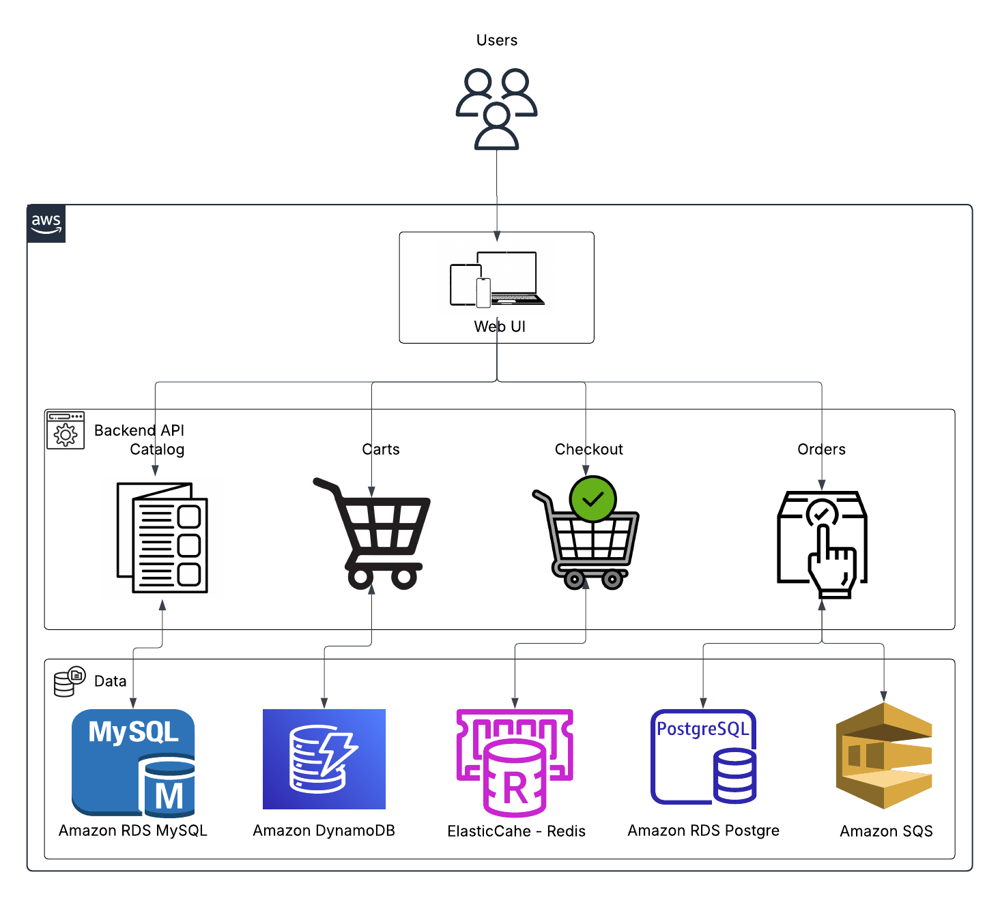

Microservices-based retail web platform deployed on Amazon EKS, composed of independently scalable and loosely coupled services.
#### Microservices Layer
 - **Catalog Service** — Golang-based microservice responsible for product catalog management and inventory retrieval.
 - **Cart Service** — Java Spring Boot service handling shopping cart state management and session operations.
 - **Checkout Service** — Node.js microservice responsible for order processing and transaction orchestration.
 - **Orders Service** — Java Spring Boot service managing order lifecycle, persistence, and order state transitions.
 - **UI Service** — Java Spring Boot frontend application serving the customer-facing retail interface.
#### Data Layer
 - **Amazon RDS MySQL** — Relational database supporting transactional application workloads.
 - **Amazon RDS PostgreSQL** — Relational database used for service-specific persistent storage requirements.
 - **Amazon DynamoDB** — Fully managed NoSQL database supporting high-scale low-latency key-value access patterns.
#### Caching Layer
 - **Amazon ElastiCache Redis** — In-memory distributed caching layer used for low-latency data access, session acceleration, and performance optimization.
#### Messaging Layer
 - **Amazon SQS** — Managed asynchronous messaging service enabling decoupled inter-service communication and event-driven workload processing.